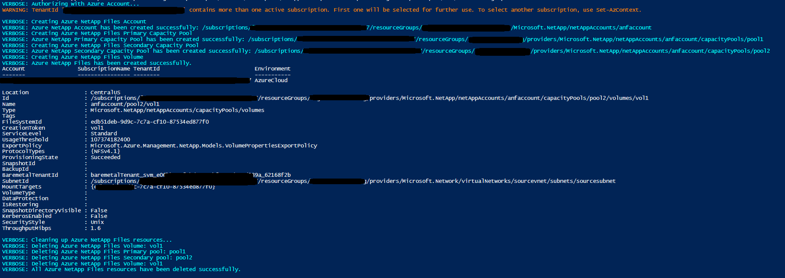

# Azure NetAppFiles Script Sample - Pool Change for PowerShell 

This project demonstrates how to use PowerShell sample application to perform a pool change on a Volume for the Microsoft.NetApp
resource provider.

In this sample application we perform the following operations:

* Creations
    * ANF Account
    * Primary Capacity Pool in service level Premium
    * Secondary Capacity Pool in service level Standard
    * Volume in the Primary pool
* Updates
    * Perform pool change, moving Volume from Primary capacity pool to Secondary capacity pool
* Deletions
    * Volume
    * Primary Capacity Pool
    * Secondary Capacity Pool
    * ANF Account

>Note: The cleanup execution is disabled by default. If you want to run this end to end with the cleanup, please
>change value of boolean variable 'CleanupResources' in ANFPoolChange.ps1

If you don't already have a Microsoft Azure subscription, you can get a FREE trial account [here](http://go.microsoft.com/fwlink/?LinkId=330212).

## Prerequisites

1. Azure Subscription
1. Subscription needs to be enabled for Azure NetApp Files. For more information, please refer to [this](https://docs.microsoft.com/azure/azure-netapp-files/azure-netapp-files-register#waitlist) document.
1. (Valid only while Pool Change feature is in preview state) Request preview access for Azure NetApp Files Pool Change. For more information, please refer to [this](https://docs.microsoft.com/en-us/azure/azure-netapp-files/dynamic-change-volume-service-level#register-the-feature) document.
1. Resource Group created
1. Virtual Network with a delegated subnet to Microsoft.Netapp/volumes resource. For more information, please refer to [Guidelines for Azure NetApp Files network planning](https://docs.microsoft.com/en-us/azure/azure-netapp-files/azure-netapp-files-network-topologies)

# What is netappfiles-powershell-pool-change-script-sample doing? 

This sample is dedicated to demonstrating how to perform a pool change on a Volume in Azure NetApp Files.
This project will first create an ANF Account and then two Capacity Pools, one at a Premium service level tier, and another at a Standard service level tier.
Then it will create a single Volume in the Premium tier Capacity Pool.
Finally, the sample will perform the pool change operation on the Volume by moving it to the Standard tier Capacity Pool.

There is a section in the code dedicated to remove created resources. By default this sample will not remove all created resources;
this behavior is controlled by a boolean variable called 'CleanupResources' in the ANFPoolChange.ps1 class. If you want to erase all resources right after the
creation operations, set this variable to 'true'.

# How the project is structured

The following table describes all files within this solution:

| Folder      | FileName                | Description                                                                                                                         |
|-------------|-------------------------|-------------------------------------------------------------------------------------------------------------------------------------|
| Root        | ANFPoolChange.ps1        | Authenticates and executes all operations                                                                                           |

# How to run the script sample application

1. Clone it locally
    ```powershell
    git clone https://github.com/Azure-Samples/netappfiles-powershell-pool-change-script-sample.git
    ```
1. Change folder to **netappfiles-powershell-Pool-Change-script-sample\src**
1. Open ANFPoolChange.ps1 and edit all the parameters
1. Save and close
1. Run the following command
	``` powershell
	ANFPoolChange.ps1
	```
Sample output


# References

* [Sign in with Azure PowerShell](https://docs.microsoft.com/en-us/powershell/azure/authenticate-azureps?view=azps-4.8.0)
* [Azure PowerShell AZ Module](https://docs.microsoft.com/en-us/powershell/azure/new-azureps-module-az?view=azps-4.8.0)
* [AZ.NetAppFile](https://docs.microsoft.com/en-us/powershell/module/az.netappfiles/?view=azps-4.8.0#netapp-files)
* [Resource limits for Azure NetApp Files](https://docs.microsoft.com/en-us/azure/azure-netapp-files/azure-netapp-files-resource-limits)
* [Azure Cloud Shell](https://docs.microsoft.com/en-us/azure/cloud-shell/quickstart)
* [Azure NetApp Files documentation](https://docs.microsoft.com/en-us/azure/azure-netapp-files/)
* [Download Azure SDKs](https://azure.microsoft.com/downloads/)
 
